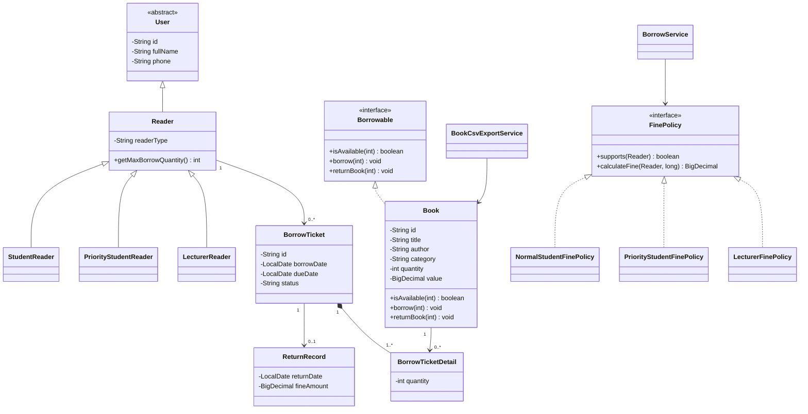

# Sơ đồ lớp

```mermaid
classDiagram
    class User {
        <<abstract>>
        -String id
        -String fullName
        -String phone
    }
    class Reader {
        -String readerType
        +getMaxBorrowQuantity() int
    }
    class StudentReader
    class PriorityStudentReader
    class LecturerReader
    class Book {
        -String id
        -String title
        -String author
        -String category
        -int quantity
        -BigDecimal value
        +isAvailable(int) boolean
        +borrow(int) void
        +returnBook(int) void
    }
    class Borrowable {
        <<interface>>
        +isAvailable(int) boolean
        +borrow(int) void
        +returnBook(int) void
    }
    class BorrowTicket {
        -String id
        -LocalDate borrowDate
        -LocalDate dueDate
        -String status
    }
    class BorrowTicketDetail {
        -int quantity
    }
    class ReturnRecord {
        -LocalDate returnDate
        -BigDecimal fineAmount
    }
    class FinePolicy {
        <<interface>>
        +supports(Reader) boolean
        +calculateFine(Reader, long) BigDecimal
    }
    class NormalStudentFinePolicy
    class PriorityStudentFinePolicy
    class LecturerFinePolicy
    class BorrowService
    class BookCsvExportService

    User <|-- Reader
    Reader <|-- StudentReader
    Reader <|-- PriorityStudentReader
    Reader <|-- LecturerReader
    Borrowable <|.. Book
    FinePolicy <|.. NormalStudentFinePolicy
    FinePolicy <|.. PriorityStudentFinePolicy
    FinePolicy <|.. LecturerFinePolicy
    Reader "1" --> "0..*" BorrowTicket
    BorrowTicket "1" *-- "1..*" BorrowTicketDetail
    Book "1" --> "0..*" BorrowTicketDetail
    BorrowTicket "1" --> "0..1" ReturnRecord
    BorrowService --> FinePolicy
    BookCsvExportService --> Book
```
